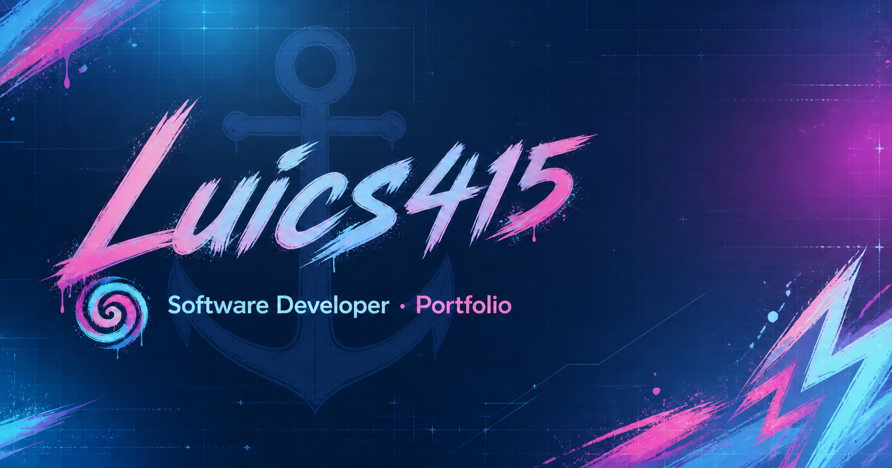

# Portafolio de Luics415

Sitio profesional de **Luics415**, desarrollador de software enfocado en aplicaciones web, experiencias educativas, videojuegos, visión por computadora y herramientas interactivas.

[](https://luics415.github.io/)
[](https://github.com/Luics415/Luics415.github.io/actions/workflows/deploy-pages.yml)
[](LICENSE)

**Sitio:** [luics415.github.io](https://luics415.github.io/)



> Este repositorio contiene el artefacto estático publicado en GitHub Pages. Los archivos JavaScript y CSS están compilados y optimizados para producción; el desarrollo estructural debe realizarse en el proyecto fuente y posteriormente exportarse de nuevo.

## Índice

- [Objetivo](#objetivo)
- [Qué incluye](#qué-incluye)
- [Proyectos destacados](#proyectos-destacados)
- [Diseño e identidad visual](#diseño-e-identidad-visual)
- [Arquitectura técnica](#arquitectura-técnica)
- [Ejecución local](#ejecución-local)
- [Despliegue](#despliegue)
- [Mantenimiento](#mantenimiento)
- [Calidad, accesibilidad y rendimiento](#calidad-accesibilidad-y-rendimiento)
- [Licencia y derechos](#licencia-y-derechos)

## Objetivo

El portafolio presenta los **12 repositorios externos de la lista pública de Stars de Luics415**, tres experimentos históricos y un caso de estudio del propio sitio. Cada ficha comunica no solo el resultado visual, sino también el objetivo, la arquitectura, el flujo de ejecución, las decisiones técnicas, los compromisos y la evidencia disponible.

Sus objetivos principales son:

- concentrar proyectos de distintas disciplinas en una identidad coherente;
- mostrar capturas reales, tecnologías y enlaces verificables;
- ofrecer fichas individuales que expliquen el valor y la implementación;
- mantener navegación accesible y responsiva en escritorio y dispositivos móviles;
- publicar automáticamente mediante GitHub Pages sin infraestructura de servidor.

## Qué incluye

| Área | Contenido |
| --- | --- |
| Portada | Firma digital de Luics415, presentación profesional y accesos principales. |
| Proyectos | Cinco casos destacados para reclutamiento, catálogo completo de Stars y experimentos separados. |
| Exploración | Búsqueda por proyecto o tecnología y filtros por Web, Escritorio, Móvil, Videojuegos, Visión y Educación. |
| Fichas técnicas | Objetivo, arquitectura, flujo, decisiones, compromisos, código con procedencia, evidencia visual y relacionados. |
| Caso de estudio | Arquitectura y decisiones de `Luics415.github.io`, fuera del catálogo de repositorios externos. |
| Perfil | Experiencia, especialidades y nueve servicios de desarrollo, gestión, calidad y documentación. |
| Identidad visual | Paleta inspirada en Arcane, recortes de grafitis icónicos de Jinx y emblema de ancla con “L”. |
| Metadatos | SEO básico, Open Graph, imagen social, favicon, canonical y `robots.txt`. |
| Publicación | Flujo automático de GitHub Actions hacia GitHub Pages. |

## Proyectos destacados

La selección principal para conversación laboral reúne cinco proyectos:

1. [AussieCare](https://luics415.github.io/proyectos/aussiecare/): PWA educativa, cinematográfica y offline-first.
2. [Bio-Gesture Control Android](https://luics415.github.io/proyectos/bio-gesture-control-android/): visión por computadora, transformación de coordenadas y Accesibilidad en Android.
3. [KASA Service Tracker](https://luics415.github.io/proyectos/kasa-service-tracker/): aplicación .NET 8 con persistencia JSON, trazabilidad y exportación XLSX.
4. [Tlalne-Priority](https://luics415.github.io/proyectos/tlalne-priority/): C++20, cola de prioridad, índice por folio y persistencia CSV.
5. [Dev Visualizer](https://luics415.github.io/proyectos/dev-visualizer/): atlas técnico estático con manifiesto central y escenas accesibles.

El [catálogo completo](https://luics415.github.io/#projects) conserva además Palabra y Oración, GX Pets y ARMY Edition, Bio-Gesture Control Pro, Sistema de Becas y las dos ediciones de EternalMazesRPG.

### Política de evidencia técnica

- Las capturas reales se identifican como evidencia visual del proyecto.
- Si un repositorio no publica capturas, la ficha muestra una portada editorial y lo declara explícitamente.
- Los extractos reales enlazan el archivo, las líneas y un commit inmutable del repositorio público.
- El código de la fuente de trabajo, una reconstrucción conceptual y una base externa se distinguen con estados visuales diferentes.
- Todo patrón genérico se rotula como **reconstrucción conceptual** y nunca se presenta como extracto literal del repositorio.
- Cubo Rubik se documenta como integración de una base externa y conserva la atribución a *The Cube* de bsehovac.
- Los estados distinguen código o binarios presentes en el repositorio de una GitHub Release pública.

## Diseño e identidad visual

La dirección visual combina azul profundo, cian, rosa y magenta. La firma digital **Luics415** y el ancla con la letra **L** funcionan como elementos centrales de marca.

El fondo utiliza 22 sprites transparentes obtenidos de los recortes de grafitis de Jinx seleccionados para este portafolio personal. El segundo conjunto reemplaza el rótulo `JINX` incompleto, incorpora `GET JINXED`, separa seis stickers y añade una composición de nubes y balas. El procesamiento conserva los valores RGB del material aportado y reconstruye únicamente el canal alfa; no redibuja, recolorea ni sustituye los motivos. Las piezas se distribuyen también por el centro con opacidades moderadas y trayectorias lentas. Se muestran 18 en tableta y 10 en móvil; `prefers-reduced-motion` desactiva el movimiento.

## Arquitectura técnica

```text
Luics415.github.io/
├── index.html                 Página principal prerenderizada
├── proyectos/                Quince fichas técnicas prerenderizadas
├── caso-de-estudio/          Caso técnico del propio portafolio
├── assets/                   JavaScript, CSS e imágenes con hash
├── graffiti-v4/              Sprites WebP transparentes de los grafitis del fondo
├── graffiti-v5/              Nuevos recortes PNG, stickers separados y manifiesto
├── docs/screenshots/         Capturas estables para documentación
├── og.png                    Imagen para compartir el sitio
├── luics415-icon-*.png       Iconos de la marca
├── robots.txt                Directivas para rastreadores
├── .nojekyll                 Publicación directa sin Jekyll
└── .github/workflows/        Automatización de GitHub Pages
```

### Tecnologías de la aplicación

- React y TypeScript para la interfaz.
- TanStack Router para navegación y generación de rutas.
- Vite para compilación y optimización de producción.
- CSS responsivo con variables de diseño y utilidades compiladas.
- Lucide para iconografía funcional.
- GitHub Actions y GitHub Pages para entrega continua.

### Estrategia de publicación

El proyecto se prerenderiza antes de llegar a este repositorio. Como resultado, la portada y cada ficha existen como documentos HTML estáticos. Los recursos incluyen hashes en sus nombres para evitar conflictos de caché entre versiones.

## Ejecución local

Este repositorio no necesita instalar dependencias para visualizar el artefacto publicado. Debe servirse mediante HTTP para reproducir correctamente las rutas y módulos.

Con Python:

```bash
python -m http.server 8080
```

Después abre `http://localhost:8080/`.

También puede utilizarse cualquier servidor de archivos estáticos. Abrir `index.html` directamente mediante `file://` no representa el entorno real de GitHub Pages.

## Despliegue

El flujo [`.github/workflows/deploy-pages.yml`](.github/workflows/deploy-pages.yml) se ejecuta con cada cambio enviado a `main`:

1. descarga el contenido del repositorio;
2. configura el entorno de GitHub Pages;
3. empaqueta la raíz como sitio estático;
4. publica el artefacto;
5. actualiza [luics415.github.io](https://luics415.github.io/).

En **Settings → Pages → Build and deployment**, la fuente debe permanecer configurada como **GitHub Actions**.

## Mantenimiento

Para añadir o modificar un proyecto:

1. actualiza la fuente de datos del portafolio;
2. incorpora una portada y capturas reales optimizadas o una portada editorial claramente declarada;
3. completa resumen, rol, año, tecnologías, enlaces, puntos destacados, procedencia y secciones técnicas;
4. valida la compilación y todas las rutas prerenderizadas;
5. copia la nueva salida estática a este repositorio;
6. publica y verifica que GitHub Actions termine correctamente;
7. abre la página pública y confirma recursos, navegación y enlaces externos.

No deben editarse manualmente los archivos minificados salvo una emergencia documentada, porque esos cambios se perderán en la siguiente exportación.

## Calidad, accesibilidad y rendimiento

- Diseño adaptable a móvil y escritorio.
- Navegación mediante teclado y nombres accesibles en controles interactivos.
- Texto alternativo en imágenes relevantes.
- Respeto por `prefers-reduced-motion`.
- Carga diferida de capturas fuera del primer viewport.
- Composición responsive del fondo: escritorio utiliza 14 sprites y móvil conserva siete motivos periféricos.
- Búsqueda tolerante a tildes, filtros accesibles y contador anunciado mediante `aria-live`.
- Menú móvil con cierre mediante `Escape` y objetivos táctiles de al menos 44 px.
- Bloques de código con desplazamiento interno, sin provocar desbordamiento de la página.
- Imágenes WebP cuando resulta conveniente.
- Prerenderizado de la portada y las páginas de proyectos.
- Recursos versionados para una caché segura.
- Enlaces externos aislados mediante `noopener noreferrer`.

## Licencia y derechos

### Código

El código original de este repositorio se distribuye bajo la [Licencia MIT](LICENSE), salvo que un archivo indique condiciones diferentes. Cualquier copia o distribución sustancial debe conservar el aviso de copyright y el texto de la licencia.

### Marca e identidad visual

La Licencia MIT **no concede derechos de uso sobre la marca**. El nombre **Luics415**, su firma digital, el emblema de ancla con la letra “L”, logotipos, iconos, banners y demás elementos distintivos están reservados por su titular. No pueden utilizarse para sugerir autoría, afiliación, patrocinio o respaldo sin autorización previa.

### Grafitis del fondo

Los recortes de grafitis asociados visualmente a Jinx se incorporan como ambientación de este portafolio personal y no se ofrecen bajo la Licencia MIT. El proceso de integración se limita a transparencia, recorte, posición y movimiento; la documentación no atribuye su autoría a Luics415.

### Capturas y proyectos enlazados

Las capturas se incluyen con fines de documentación del portafolio. Cada proyecto conserva su propia licencia y sus derechos sobre código, contenido, datos, marcas e imágenes. La presencia de un proyecto aquí no cambia ni amplía su licencia original.

### Inspiración artística

La paleta cromática y la atmósfera visual están inspiradas en una estética de animación y grafiti. Este portafolio no está afiliado, patrocinado ni respaldado por Riot Games, Fortiche, Netflix ni por los titulares de *Arcane* o *League of Legends*. Sus marcas y obras pertenecen a sus respectivos propietarios.

Consulta [THIRD_PARTY_NOTICES.md](THIRD_PARTY_NOTICES.md) para conocer las dependencias, servicios y atribuciones relevantes.

## Autor

**Luics415** — diseño, desarrollo, documentación y mantenimiento.

- GitHub: [github.com/Luics415](https://github.com/Luics415)
- Portafolio: [luics415.github.io](https://luics415.github.io/)
